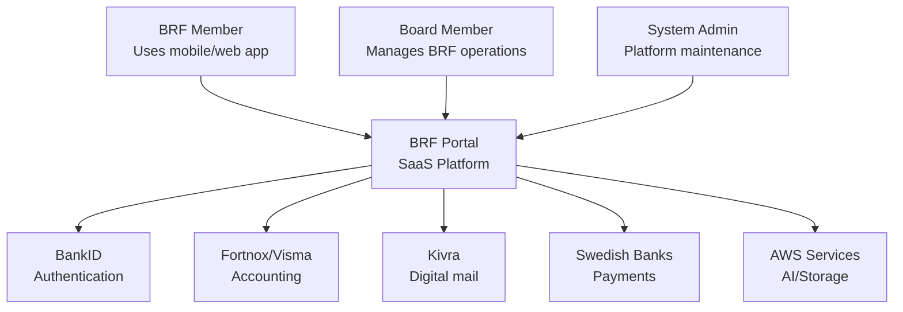
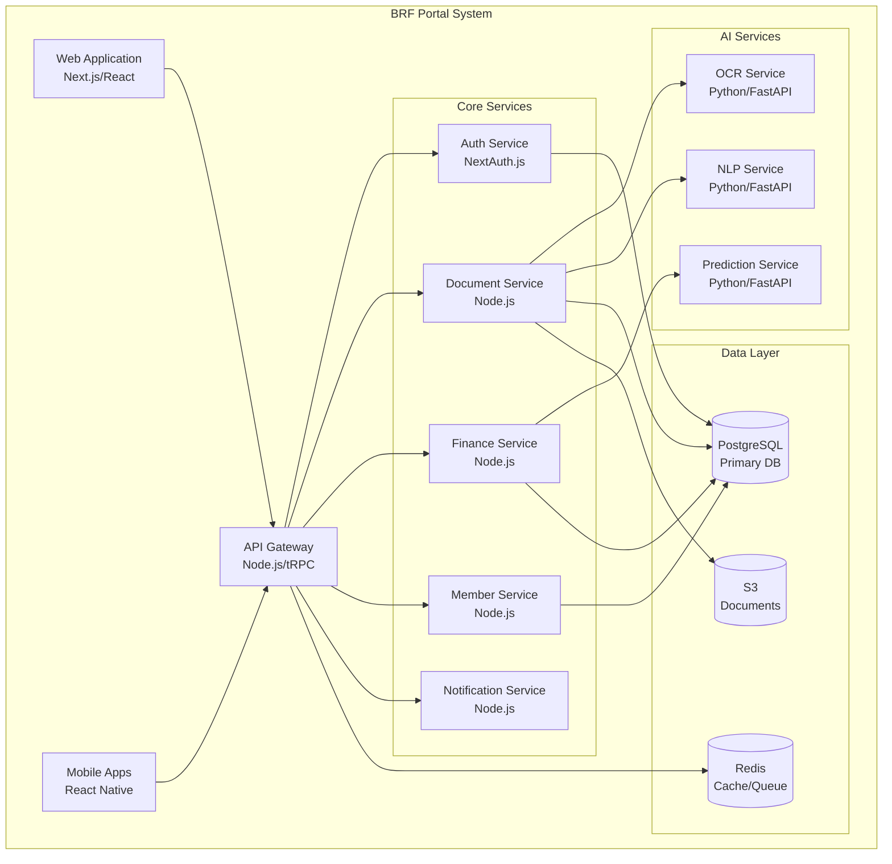
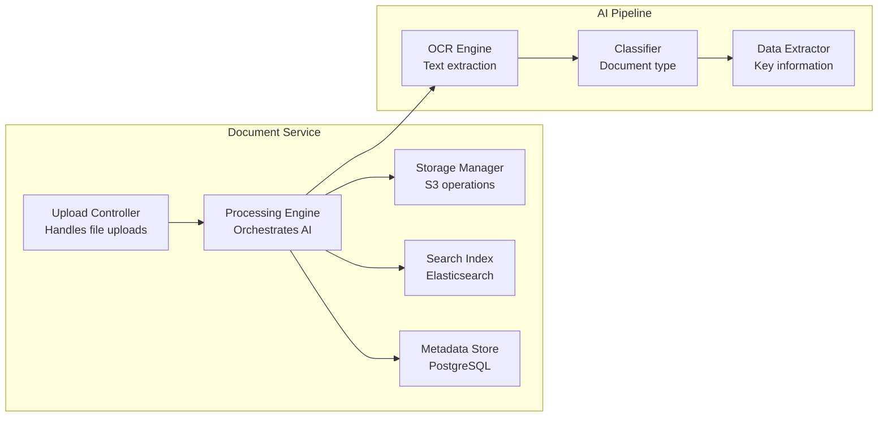
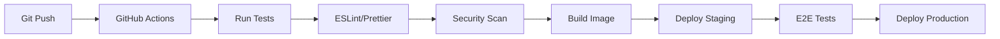

# BRF Portal - System Architecture (C4 Model)

## Development Philosophy - Maximize Zero-Cost Building

Build as much as possible before spending money. The architecture supports running everything locally during development, then migrating to cloud services only when paying customers arrive.

### What You Can Build for Free (Months 1-6)

- **100% of the UI/UX**: Complete Next.js application
- **100% of business logic**: All calculations and workflows
- **95% of features**: Everything except external integrations
- **Complete database**: SQLite with full schema
- **Mock integrations**: Simulate BankID, Fortnox, banks
- **Test suite**: Full coverage

### What Requires Money (Only when customers pay)

- **External services**: BankID, GPT-4, SMS
- **Hosting**: Beyond free tiers
- **Email at scale**: Beyond free tier limits

## Architecture Phases

### Phase 0: Local Development (Zero Cost)

```
┌─────────────────────────────────┐
│     Next.js Application         │
│   (Complete UI, all screens)    │
└─────────────────────────────────┘
            │
┌─────────────────────────────────┐
│    Local API Routes (Next.js)   │
│   (All business logic)          │
└─────────────────────────────────┘
            │
┌─────────────────────────────────┐
│      SQLite Database            │
│   (Complete schema)             │
└─────────────────────────────────┘
            │
┌─────────────────────────────────┐
│     Local File System           │
│   (Document storage)            │
└─────────────────────────────────┘
```

### Phase 1: MVP Deployment (Minimal Cost)

```
Add only:
- Vercel hosting (free tier)
- Supabase (free tier - 500MB)
- Custom domain (~100 kr/year)
```

### Phase 2: Production (With Revenue)

```
Add when justified by revenue:
- BankID (€49/month + per use)
- GPT-4 API (pay per use)
- SMS/Email services
- Supabase Pro ($25/month)
```

## Level 1: System Context



**Purpose**: Multi-tenant SaaS platform for Swedish housing cooperative management
**Users**:

- BRF Members (residents)
- Board Members (administrators)
- System Administrators (platform operators)

## Level 2: Container Diagram



## Level 3: Component Diagram - Document Service



## System Architecture Principles

### 1. Multi-Tenancy Strategy

- **Shared Database**: Single PostgreSQL instance with row-level security
- **Tenant Isolation**: Every table has `cooperative_id` column
- **Data Segregation**: PostgreSQL RLS policies enforce isolation
- **Subdomain Routing**: `{brf-name}.brfportal.se` identifies tenant

### 2. Security Architecture

```
┌─────────────────────────────────────┐
│         Security Layers             │
├─────────────────────────────────────┤
│ Layer 1: BankID Authentication      │
│ Layer 2: JWT Token Management       │
│ Layer 3: Role-Based Access Control  │
│ Layer 4: Row-Level Security (DB)    │
│ Layer 5: API Rate Limiting          │
│ Layer 6: End-to-End Encryption      │
└─────────────────────────────────────┘
```

### 3. Data Flow Architecture

#### System Boundaries by Subscription Level

#### STANDARD Subscription - Document Collection

```
┌─────────────────────────────────────┐
│       STANDARD Features             │
├─────────────────────────────────────┤
│ ✅ Document Upload & Storage        │
│ ✅ NEW Button (procurement)         │
│ ✅ Invoice Collection               │
│ ✅ AI Categorization                │
│ ✅ Member Portal                    │
│ ✅ Case Management                  │
│ ✅ Booking System                   │
│ ✅ Export to Accountant             │
├─────────────────────────────────────┤
│ ❌ NO Bookkeeping                   │
│ ❌ NO Payment Processing            │
│ ❌ NO Tax Reporting                 │
│ ❌ NO Annual Reports                │
└─────────────────────────────────────┘
```

#### PREMIUM Subscription - Complete Financial Management

```
┌─────────────────────────────────────┐
│    PREMIUM Features (All of above)  │
├─────────────────────────────────────┤
│ ✅ Everything in STANDARD           │
│ PLUS:                               │
│ ✅ Complete Bookkeeping (K2/K3)    │
│ ✅ Payment Processing               │
│ ✅ Bank Reconciliation              │
│ ✅ Fee Invoicing with OCR           │
│ ✅ Direct Debit (Autogiro)         │
│ ✅ VAT Management                   │
│ ✅ Annual Reports (Årsredovisning)  │
│ ✅ Tax Declarations (Skatteverket)  │
│ ✅ Fortnox/Visma Integration       │
│ ✅ Audit Trail (Bokföringslagen)   │
│ ✅ Collection Process               │
└─────────────────────────────────────┘
```

## Energy Optimization Architecture (Phased)

### Phase 0: Manual Energy Optimization (Zero Cost)

```
┌─────────────────────────────────────┐
│   Manual Data Collection             │
├─────────────────────────────────────┤
│ Board uploads invoices (PDF)        │
│ Vaktmästare photos meters           │
│ Manual consumption entry             │
└─────────────────────────────────────┘
                ↓
┌─────────────────────────────────────┐
│   Local Processing (No External API)│
├─────────────────────────────────────┤
│ OCR extracts consumption from PDFs  │
│ Database stores provider prices     │
│ (manually updated monthly)          │
│ Simple comparison calculations       │
└─────────────────────────────────────┘
                ↓
┌─────────────────────────────────────┐
│   Basic Recommendations             │
├─────────────────────────────────────┤
│ Compare 3-5 major providers         │
│ Rule-based heating optimization     │
│ Manual switching guides              │
└─────────────────────────────────────┘
```

### Phase 1: Semi-Automated (Minimal Cost)

```
Add:
- CSV import from grid companies
- Web scraping public prices (free)
- SMHI degree days (free API)
- More sophisticated calculations
```

### Phase 2: Partner Integration (When Revenue >50k/month)

```
┌─────────────────────────────────────┐
│     External Energy Data Sources     │
├─────────────────────────────────────┤
│ Grid Companies (API integration)     │
│ District Heating Portals (API)      │
│ Nord Pool (spot prices)             │
└─────────────────────────────────────┘
                ↓
┌─────────────────────────────────────┐
│     Sally R / Eliq API (~1500/mo)   │
├─────────────────────────────────────┤
│ Automatic price comparison           │
│ 10+ provider analysis               │
│ Contract optimization               │
└─────────────────────────────────────┘
```

### Energy Data Without External APIs

```sql
-- Store public electricity prices (updated manually)
CREATE TABLE electricity_prices (
    id TEXT PRIMARY KEY,
    provider TEXT, -- Vattenfall, EON, Tibber
    price_type TEXT, -- fixed, variable
    price_per_kwh REAL,
    monthly_fee REAL,
    valid_from TEXT,
    valid_to TEXT,
    manually_updated TEXT
);

-- Basic comparison without API
SELECT
    provider,
    (consumption * price_per_kwh + monthly_fee) as estimated_cost,
    (current_cost - (consumption * price_per_kwh + monthly_fee)) as savings
FROM electricity_prices
WHERE valid_from <= date('now')
    AND valid_to >= date('now')
ORDER BY estimated_cost;
```

#### Financial Transaction Flow

```
1. Invoice uploaded → Document Service
2. AI extraction → Amount, supplier, dates
3. Validation → Finance Service
4. Approval workflow → Board members
5. Payment file → Bank integration
6. Reconciliation → Automatic matching
7. Booking → Fortnox/Visma sync
8. Audit trail → Immutable log
```

## Technology Stack Details

### Frontend Architecture

```yaml
Web Application:
  Framework: Next.js 14 (App Router)
  Language: TypeScript
  State: Zustand + React Query
  Styling: Tailwind CSS + Radix UI
  Forms: React Hook Form + Zod
  Charts: Recharts
  Supabase Client: @supabase/supabase-js

Mobile Applications:
  Framework: React Native + Expo
  Navigation: React Navigation
  State: Redux Toolkit
  Offline: WatermelonDB synced with Supabase
  Push: Expo Notifications
  Supabase: @supabase/supabase-js
```

### Backend Architecture (Supabase)

```yaml
Database:
  Platform: Supabase (PostgreSQL 15)
  Multi-tenancy: Row Level Security (RLS)
  Migrations: Supabase CLI

Auth:
  Provider: Supabase Auth
  Methods: BankID (via custom provider), Email/Password
  Sessions: JWT tokens

Storage:
  Service: Supabase Storage
  Structure: /{cooperative_id}/{year}/{month}/documents

Edge Functions:
  Runtime: Deno
  Languages: TypeScript, Python (via Pyodide)
  Deployment: Supabase CLI

Realtime:
  Protocol: WebSockets
  Subscriptions: PostgreSQL LISTEN/NOTIFY
  Presence: Online users tracking
```

### Database Architecture

```sql
-- Multi-tenant schema with RLS
CREATE TABLE cooperatives (
    id UUID PRIMARY KEY,
    name TEXT NOT NULL,
    org_number TEXT UNIQUE,
    subdomain TEXT UNIQUE,
    settings JSONB
);

CREATE TABLE members (
    id UUID PRIMARY KEY,
    cooperative_id UUID REFERENCES cooperatives(id),
    personal_id_hash TEXT, -- GDPR compliant
    apartment_id UUID,
    role TEXT CHECK (role IN ('member', 'board', 'admin'))
);

CREATE TABLE documents (
    id UUID PRIMARY KEY,
    cooperative_id UUID REFERENCES cooperatives(id),
    uploaded_by UUID REFERENCES members(id),
    type TEXT,
    metadata JSONB,
    s3_key TEXT,
    processed BOOLEAN DEFAULT false
);

-- Row Level Security
ALTER TABLE members ENABLE ROW LEVEL SECURITY;
CREATE POLICY tenant_isolation ON members
    USING (cooperative_id = current_setting('app.current_cooperative')::uuid);
```

## Scalability Architecture

### Horizontal Scaling Strategy

```
┌─────────────────────────────────────┐
│    Load Balancer (Nginx/HAProxy)    │
└─────────────────────────────────────┘
         │         │         │
    ┌────▼──┐ ┌───▼───┐ ┌───▼───┐
    │ API 1 │ │ API 2 │ │ API 3 │
    └───┬───┘ └───┬───┘ └───┬───┘
        │         │         │
    ┌───▼─────────▼─────────▼───┐
    │   PostgreSQL (Primary)     │
    └────────────┬───────────────┘
                 │
    ┌────────────▼───────────────┐
    │  Read Replicas (1-3)       │
    └────────────────────────────┘
```

### Caching Strategy

- **Redis L1 Cache**: Session data, API responses (TTL: 5 min)
- **PostgreSQL Materialized Views**: Reports, analytics
- **CDN**: Static assets, images
- **Browser Cache**: Aggressive caching with versioning

### Queue Architecture

```yaml
Queues:
  document-processing:
    - OCR extraction
    - Classification
    - Data extraction

  financial-processing:
    - Invoice matching
    - Payment generation
    - Reconciliation

  notifications:
    - Email sending
    - SMS sending
    - Push notifications

  maintenance:
    - Backup jobs
    - Report generation
    - Data cleanup
```

## Deployment Architecture

### Infrastructure as Code

```yaml
Production:
  Region: eu-north-1 (Stockholm)
  Compute: AWS ECS Fargate / Railway
  Database: AWS RDS PostgreSQL
  Cache: AWS ElastiCache Redis
  Storage: AWS S3 + CloudFront

Staging:
  Region: eu-north-1
  Compute: Single EC2 instance
  Database: PostgreSQL on instance
  Cache: Redis on instance
  Storage: S3 bucket

Development:
  Local: Docker Compose
  Database: PostgreSQL container
  Cache: Redis container
  Storage: LocalStack S3
```

### CI/CD Pipeline



## Monitoring & Observability

### Metrics Collection

```yaml
Application Metrics:
  - Request latency (p50, p95, p99)
  - Error rates by endpoint
  - Active users/cooperatives
  - Document processing time

Infrastructure Metrics:
  - CPU/Memory utilization
  - Database connections
  - Queue lengths
  - S3 storage usage

Business Metrics:
  - New signups
  - Churn rate
  - Feature usage
  - Invoice processing volume
```

### Logging Strategy

- **Structured Logging**: JSON format with correlation IDs
- **Log Aggregation**: CloudWatch Logs / ELK Stack
- **Error Tracking**: Sentry for exceptions
- **Audit Logs**: Immutable financial transaction logs

## Disaster Recovery

### Backup Strategy

```
Continuous: Database replication (1 min lag)
Hourly: Database snapshots (48 hour retention)
Daily: Full backups (30 day retention)
Monthly: Archive backups (7 year retention)
```

### Recovery Targets

- **RTO (Recovery Time)**: 4 hours
- **RPO (Recovery Point)**: 1 hour
- **Availability Target**: 99.9% uptime

## Performance Requirements

### API Response Times

- Authentication: <500ms
- Document upload: <2s
- Search queries: <200ms
- Report generation: <5s
- Real-time updates: <100ms

### Throughput Targets

- Concurrent users: 10,000
- API requests/sec: 1,000
- Document processing: 100/min
- Database queries/sec: 5,000

## Security Considerations

### Data Protection

- **Encryption at Rest**: AES-256 for database and S3
- **Encryption in Transit**: TLS 1.3 for all connections
- **PII Handling**: Hashing, tokenization, minimal retention
- **GDPR Compliance**: Right to erasure, data portability

### Access Control Matrix

```
Role        | Documents | Finance | Members | Settings
------------|-----------|---------|---------|----------
Member      | Read own  | None    | Read    | Read
Board       | Full      | Full    | Full    | Write
Admin       | Full      | Full    | Full    | Full
System      | Full      | Full    | Full    | Full
```

---

_Architecture Version: 1.0_
_Last Updated: January 2025_
_Next Review: Q2 2025_
